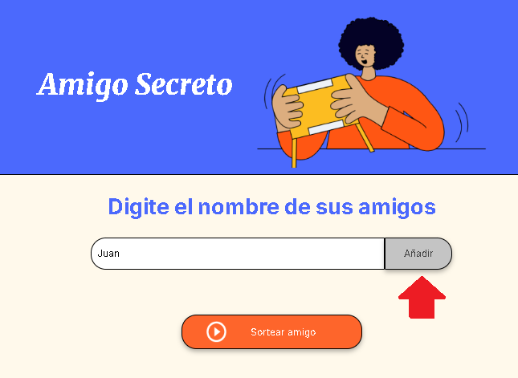
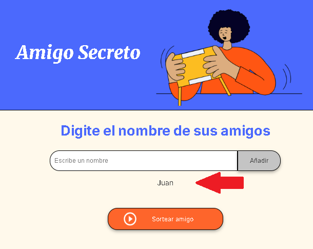
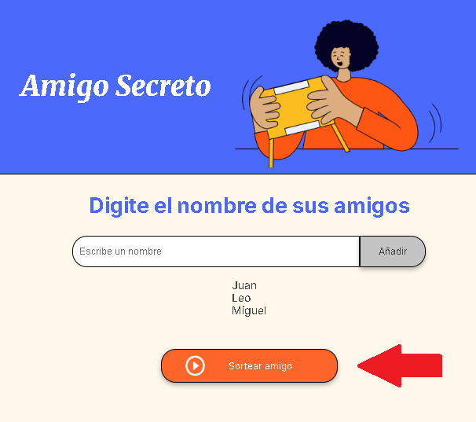
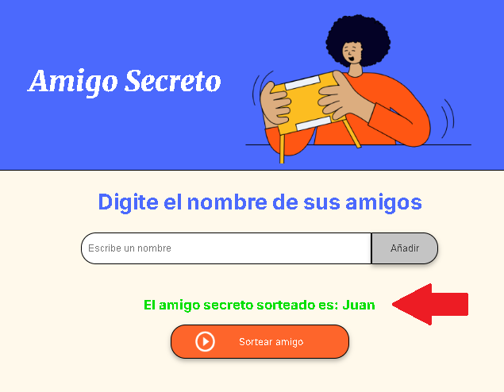

# Amigo Secreto

## Descripción
Este proyecto es una aplicación web que realiza un sorteo de nombres de amigos. Los usuarios pueden ingresar una lista de nombres y, con solo presionar un botón, el sistema seleccionará aleatoriamente a un amigo secreto.

## Tecnologías utilizadas
- **HTML**: Para la estructura de la página.
- **CSS**: Para agregar estilos y mejorar la apariencia de la página.
- **JavaScript**: Para la manipulación del DOM y darle funcionamiento a la página.

## Funcionalidades
✅ Permite agregar nombres de amigos a una lista.  
✅ Muestra la lista de nombres ingresados.  
✅ Realiza el sorteo de un amigo secreto de manera aleatoria.  
✅ Muestra el resultado del sorteo.  
✅ Limpia la lista después de realizar el sorteo.  

## Instrucciones de uso
1. Abrir el archivo `index.html` en un navegador web.
2. Ingresar los nombres en el campo de texto y presionar el botón "Añadir".
3. Repetir el paso anterior hasta ingresar todos los nombres.
4. Hacer clic en el botón "Sortear amigo" para elegir un nombre al azar.
5. El nombre del amigo secreto se mostrará en pantalla.

## Paso a Paso

## Estructura del proyecto
📁 AmigoSecreto │── 📄 index.html (Estructura principal del proyecto) │── 📄 app.js (Lógica del sorteo y manipulación del DOM) │── 📄 style.css (Para mejorar la apariencia de la página) │── 📁 assets (Imágenes y recursos gráficos)

## Autor
Desarrollado por Juan Manuel Luciano 💻🚀